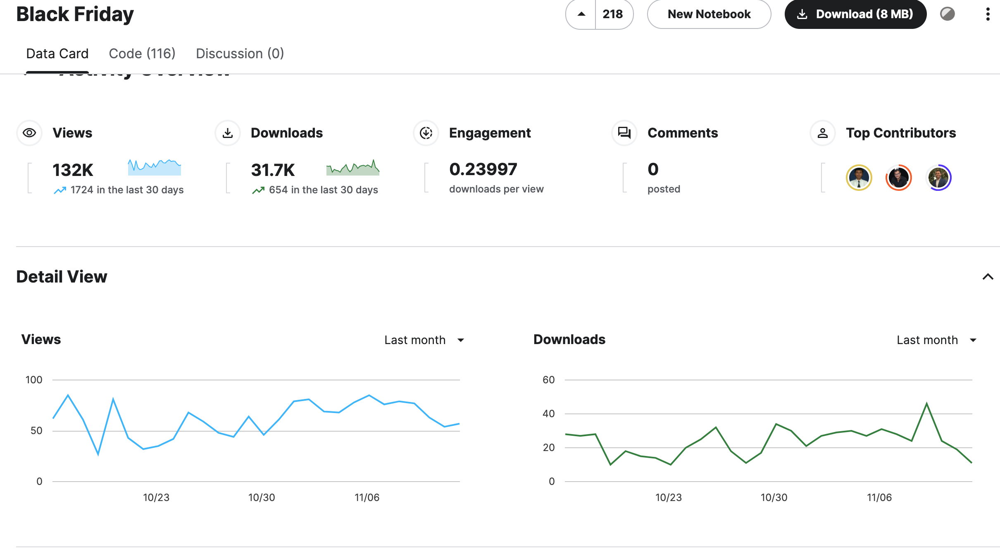
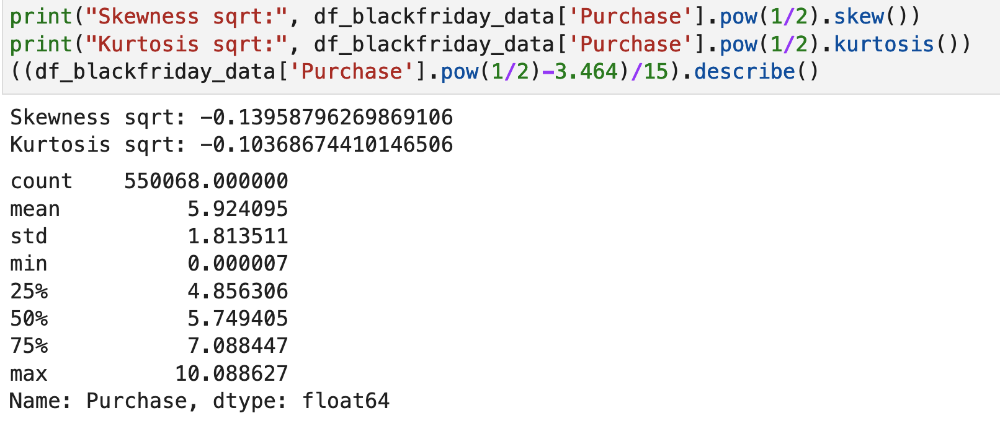

# Black Friday Case Study

The requirements for the Black Friday case study were:

> Example of an end-to-end machine learning pipeline using the Black Friday dataset to increase profits. This demo can be implemented using either Vertex AI (or Endpoints) or Dataproc, and can utilize any available machine learning library on Google Cloud (for example, XGBoost, scikit-learn, tf.Keras, Spark machine learning).

The Black Friday Kaggle dataset is a six-year-old dataset with over 31,000 downloads and 100 publicly available notebooks and articles. It remains popular and actively used.

Despite the popularity of the Kaggle Black Friday Prediction dataset, many open analyses failed to consider the business requirements adequately, leading to mostly underperforming results. Our case study revealed that the dataset’s purpose is to generate personalized predictions for individual users and products, rather than a generic regression task. By understanding the business requirements, we developed both a personalized prediction regression model and a recommendation system. We demonstrated that by properly comprehending the business requirements, we can produce high-quality work in feature engineering, model selection, and evaluation. Finally, we showcased our model development process on Vertex AI.

# Table of Content
- [3.2.1 Code](#321-code)
    - [3.2.1.1 Code repository](#3211-code-repository)
    - [3.2.1.2 Code origin certification](#3212-code-origin-certification)
- [3.2.2 Data](#322-data)
    - [3.2.2.1 Dataset in Google Cloud](#3221-dataset-in-google-cloud)
- [3.2.3 Solution](#323-solution)
    - [3.2.3.1 Business goal and machine learning solution](#3231-business-goal-and-machine-learning-solution)
    - [3.2.3.2 Data exploration](#3232-data-exploration)
    - [3.2.3.3 Feature engineering](#3233-feature-engineering)
    - [3.2.3.4 Preprocessing and the data pipeline](#3234-preprocessing-and-the-data-pipeline)
    - [3.2.3.5 Machine learning model design(s) and selection](#3235-machine-learning-model-designs-and-selection)
       - [Regressional Solutions](#Regressional-Solutions)
       - [Recommendation Solutions](#Recommendation-Solutions)
    - [3.2.3.6 Machine learning model training and development](#3236-Machine-learning-model-training-and-development)
    - [3.2.3.7 Machine learning model evaluation](#3237-Machine-learning-model-evaluation)
    - [3.2.3.8 Fairness analysis](#3238-Fairness-analysis)
- [3.2.4 Deployment](#324-Deployment)
    - [3.2.4.1 Model/ application on Google Cloud](#3241-Model-or-application-on-Google-Cloud)
    - [3.2.4.2 Callable library/ application](#3242-Callable-library-or-application)
    - [3.2.4.3 Editable Model/ application](#3243-Editable-Model-or-application)

- [Conclusion](#Conclusion)
- [Resources](#Resources)
    - [Evaluation Criteria](#Evaluation-Criteria)
    - [Recommender System](#Recommender-System)

## 3.2.1 Code
### 3.2.1.1 Code repository
    https://github.com/intelia-agility/mlspecialisation/tree/usecase2/usecase2.git

### 3.2.1.2 Code origin certification
We Intelia confirm that all code of this case study is original and developed within our organization.

## 3.2.2 Data
### 3.2.2.1 Dataset in Google Cloud
The original Black Friday Sales Prediction dataset has two data files in csv format: train.csv and test.csv. The test.csv is the private test set for the Kaggle competition leaderboard benchmarking. It doesn't have target column so is no use in this case study. Our case study is based on the train.csv only.

- GCP project: blackfridayintelia
- Data source: gs://blackfriday_data/train.csv

## 3.2.3 Solution
### 3.2.3.1 Business goal and machine learning solution
**Note:** The following analysis can be found in the 01-EDA.ipynb.

Sales prediction is important for several reasons. It helps businesses to allocate resources efficiently for future growth, manage cash flow and budgeting, determine sales quota and pricing policy, select distribution channels and find investors, compare actual sales with sales standards, improve pricing, advertising, and product development. From business perspective, there are several different drivers motivated sales prediction:
1. To identify fast-selling products for stock-filling, with the goal of reducing back-orders. Or identify slow-moving products, in order to reduce stale stock.
2. To identify top buyers, with the goal of applying segmented marketing strategies.
3. To understand personal purchasing likelihood, with the goal of providing personalized recommendations.

Although all of these methods fall under the category of sales prediction, they have different objectives. As a result, the solutions are not identical. Different objectives necessitate different approaches to feature selection and model training. For example, when the objective is to identify fast-selling products, individual users’ behavior may not be a strong feature. Conversely, when the objective is to identify top buyers, we may not care about every product’s sales. Both user and product features matter only when we are tasked to predict personalized purchase. The analysis of business goals has a significant impact on the model training process. Most machine learning models struggle when dealing with high-dimensional data. When we include either user or product as input features, we must be very careful about their impact on the model.

The business goal of the Black Friday Sales Prediction dataset was not clearly defined. This ambiguity presents the first implicit challenge. Unfortunately, all open solutions failed to recognize the problem and jumped into the solution too early.

Our analysis begins by understanding the types of analysis that the dataset can support. We start by comparing the training and test sets. It is evident that all users and products in the test set are also present in the training set. However, the combination of user and product in the test set has no intersection with the same combination in the train set.

Our goal is to predict the probability of users purchasing other products based on their previous purchases. To achieve this, we need to construct a recommendation system instead of a standard regression model. In a recommendation system, the interaction between the user and the product is the most important feature for learning personalized patterns. This is the key difference between our approach and most other Black Friday prediction analyses, which treat the task as a regular regression problem. Traditional regression models can learn the patterns very efficiently when the cardinality of the features is not too large. In the case of recommender systems, the model performs better when the data size is larger or the level of categorical features is high.

This case study aims to showcase the implementation of personalized prediction using regression technology and recommendation solutions to provide superior results. We will demonstrate that both solutions produce much better performance than all open models, based on accurate business understanding. Furthermore, we will show that the recommender model outperforms the regression model.

### 3.2.3.2 Data exploration
**Note:** The following analysis can be found in the 01-EDA.ipynb.
    
A successful machine learning project must based on solid understanding toward the data.Data exploration is an essential step in the machine learning pipeline. It helps to identify patterns, relationships, and anomalies in the data, which can be used to improve the accuracy of the model. Data exploration also helps to identify missing values, outliers, and other data quality issues that can affect the performance of the model. By understanding the data, we can make informed decisions about which features to include in the model and which to exclude. This can help to reduce overfitting and improve the generalization performance of the model.

Exploratory data analysis (EDA) is the process of analyzing and summarizing the main characteristics of the data. EDA helps to identify patterns, relationships, and anomalies in the data, which can be used to improve the accuracy of the model. EDA also helps to identify missing values, outliers, and other data quality issues that can affect the performance of the model. By understanding the data, we can make informed decisions about which features to include in the model and which to exclude. This can help to reduce overfitting and improve the generalization performance of the model.

There are different types of analysis during EDA: 
- univariate analysis, which profile each individual features. The goal is the understand the data type, missing values, and data distributaion. 
- mult-variate analysis, which looks into the interaction between two or even more data features. The goal is to identify how the data features are related to each other, especially their affiliation with the targe. 

In our EDA, we use a library 'ydata-profile' to generate univariate profiling reports and the bivariate profiling report. We use plotting to analyze three-way and four-way feature interactions to identify whether there is any specific combination of features has impactful corelation to the target. We also checked the data volum distribution imbalance and tried to find out whether the data imbalance has any connection to the target values. 

The basic information of the dataset is as follows:

1. The dataset contains 550,000 rows and 12 columns. 

There are 5,891 unique users and 3,631 unique products. This aligns with our initial assumption that users and products normally have a large number of levels. We will deal with them in the downstream process. 

Some of the features are presented as numerical data types. The profile shows that the user_id, occupation, marital_status, and the three product categories are all numerical. However, based on common sense, we can see that all of them should be categorical features. If we treat them as numerical features, their face values will imply ordinal relationships to the target, which is not true. For example, the expected target value of occupation 10 doesn’t necessarily increase or decrease from the expected target value of occupation 2. Therefore, we must ignore their face values and treat them all as categorical features.

The Product_category_2 and Product_category_3 features have a high proportion of missing values. Especially, the rate of missing values for Product_category_3 is as high as 70%. According to general best practice, features with a high volume of missing values can be treated in severl different ways. One common approach is to replace the missing values with the most frequent value in the feature. Another approach is to predict the missing values using a classifier algorithm. Or when the feature is not significant, just discard the feature. However, our analysis found that these are categorical features and we can’t conclude whether the missing values are legitimate in business. Therefore, we treat the missing values as a default level of category.

2. Most data categories are imbalanced. 

A typical example is the data volumes of males user vs. femail user. According the the profile, there are 414k male users while the number of female users is only 136k, or less than one third of male users. The reason of the imbalanced data distribution is unknown. In a real-world project settings, it's worthwhile to dig out the reason behind the imbalanced data. It could because of the nature of the business, it could be data collecting issue. We can't identify the real reason in the analysis but the wide-spread data imbalance leads us to looking into it's relation to the target values.

3. Product_Category_1 is always greater than Product_Category_2, and Product_Category_2 is always greater than Product_Category_3.

Again, this is a interesting pattern. It could means something in the real business but we cannot uncover the meaning from the analysis. It is possible that the three categories are time-bounded features. For instance, product receipt time, vs. on shelf time, vs. off-shelf time. If that is really case, additional features may be built to help the models learning more patterns, for example: the latency between category_1 and category_2, or between category_2 and category_3. We can't find out the real relationships among these features so have to assume they are no logicall related.

4. Users are not evenly distributed in the cities. Some male users of certain occupations are more popular in certain cities.

We did four-ways analysis of the interaction between city_category, occupation, gender, and the target values; and another four-ways analysis between age, occupation, gender, and the target values. We found the following patterns:

- Occupation 8 is more popular in city category B and C than in city category A; People doing occupation 8 in city category C are mostly male, while the gender imbalance of occupation 8 in city category B is not significant. 
- People doing Occupation 11 in city category A are most male. 
- Occupation 18 are mostly male. 
- Females work for occupation 8 are mostly elder women. 
- Females work for occupation 10 are mostly teenagers.
- People work for occupation 13 are mostly middle-aged or elder.
- Although there are many subtleties, the feature interactions exhibit weak correlation with the target values.

5. The purchase data, or the target, is slightly right skewed with Skewness 0.6001400037087123 and Kurtosis -0.33837756558517285

Many linear regression models implies that the numerical features follow normal distribution, while most tree-based models are not sensitive to irregular data distributions. A distribution is a perfectly normal distribution when the skewness score is 0. A distribution is considered to be right skewed when the skewness is greater than 0.5, and left skewed when the score is less than -0.5. In our case, we take the linear regression as one of the base models thus we need to correct the skewness. 

6. There are no significant purchasing behavior differences related to the user features.

We analized the mean target values against all category levels, and a three-way analysis between age, gender and the target values. We found that there are correlations of imbalanced categories and the target values. For example, the popular gender of male also has higher average target values. However, the difference is not significant. 

This is a crucial aspect of data analysis. When there is a significant correlation between data imbalance and target values, we may need to apply various approaches to address it. One way is to down-sample the popular category levels, while another solution is to up-sample the unpopular category levels. We can also use other machine learning models to generate synthetic data to make the data less biased. 

At this stage, we didn't found the data imbalance is strongly linked to very different target values. Thus it is unecessary to treat the imbalance issue. We'll double check our decision with the model training outcome. If we find the trained model performs badly because of the data imbalance, we will still have to fix it.  

### 3.2.3.3 Feature engineering
**Note:** The following analysis can be found in the 01-EDA.ipynb.
    
Based on the above explorative data analysis, we decided on the following approach in feature engineering. The code will be explained in detail in the following chapter.

1. Despite that the product_category_1, product_category_2, product_category_3, user_id, occupation, and marital_status are all numerical, they are more likely to be categorical features instead. In the following feature processing, we will treat all data features as categorical features. 

2. The product_category_2 and product_category_3 have quite a few missing values. Especially the product_category_3 has a very high missing value rate. Considering the triangular patterns between product_category_1 vs. product_category_2, and product_category_2 vs. product_category_3 we believe the missing values are on purpose. We will keep all the missing values and will deal with them in the data processing.

3. Despite the widely spread imbalanced data distribution, we didn't observe obvious target vaule differences across the categories. Therefore, we decided not to do data augmentation, data over-sampling, or any treatment. We will check again whether to treat the imbalance issue later based on the model evaluation. 

4. We decided not to introduce feature interactions because the combination of 3 and 4 features can't find strong patterns to introduce. 

5. The target column is slightly right-skewed. We will use square root transformation to bring it into normal distribution. In our downstream experiment, we will compare  models including linear models, tree models, and deep neural networks. Our tree-family model and DNN model have no problem with skewed input data, however, the linear model assumes the input follows a normal distribution. Therefore, we need to normalize the data. 

6. Because of the implementation of some of the recommendation lib, the target can only be within [0.0, 10.0]. Accordingly, we will transfer the target into that range by using the formula:

$$y_{t} = {\sqrt{y} - 3.464 \over 15}

y:\ target\ value

y_{t}:\ transformed\ target\ value}$$

There are multiple ways of normalise irregular data distributions, including log transformation, and more complicated boxcox transformation. We selected sqrt transformation because the skewness of the target wasn't too bad, thus sqrt transformation will be more suitable. After the transformation, the target data backed to normal distribution, and the range fits [0.0, 10.0]. 

    
7. We are going to experiment with two different types of models: recommender and regression. These models require different data features. Therefore, we need to prepare data in two different ways:
    
    - recommender systems: We are going to build only use user, product, and target. They are going to deal with categorical features directly. Thus no other data processing needs to be done.
    - regression systems: Categorical features to be transformed into numerical format. To avoid high-dimension issues and still preserve information as much as possible, we use target encoding to transform all 11 data features. Unlike label encoder or one-hot encoder that encodes the categories into integer IDs, target encoding uses statistical information to represent the categories. In our case, we use the category-grouped mean value of the target as the representative value. And we treat the missing value of the categories as a meaningful level.
    
    Most machine learning models can't handle categorical features directly. The categories must be encoded into numerical values. There are different ways of encoding:
    - one-hot encoding: treating every level of category as a new column. This is the most popular encoding method, however, it is not suitable for high-cardinal categories because it created large number of dimensions. When the number of dimensions is too large, the patterns among the data points get very weak. Eventually, the model will unable to learn any information from the data. This is known as curse of high-dimension.
    - label encoding: represent every level of category with a unique integer. This method will not create high dimension issue, however, the generated representative value may imply ordinal relationships to the target.
    - hasing and binning: encode large number of levels into small number of buckets. These are only applicable in some special cases because when merged together, the model can't distinguish each level's pattern. 
    - target encoding: it uses the target statistical values at each level to represent the category. The most popular representative methods are the target mean and target median. This encoding method both avoided the high-dimension issue and overcomed the problem of label-encoding. It added the connection of how the category levels related to the target values. Therefor it is a better choice in this case.  
    
### 3.2.3.4 Preprocessing and the data pipeline
**Note:** The following analysis can be found in the 05-KFP_Pipeline.ipynb.

The original data file was manually downloaded from the Kaggle website:
    https://www.kaggle.com/datasets/abhisingh10p14/black-friday

The downloaded archive.zip file contains two csv files: train.csv and test.csv. The test.csv is for the Kaggle competition leaderboard benchmarking. It has no target values so is not relevant to our case study. We use the train.csv only. The train.csv has been manually uploaded to the GCS bucket. 

    DATA_URI = "gs://blackfriday_data/train.csv"
    
The first step of the data processing is to import the CSV data file into KFP Dataset.

Then, the KFP Dataset will be imported into a Pandas Dataframe. In the mean while, all data features except the Purchase column will be cast into string data types for the downstream process to take them as categorical features.

The Purchase values will be square root transformed, and shrank into the range of [0.0, 10.0] in the transformation component:

The transformed dataset will be split into X_train, y_train, X_test, y_test in the traintestsplit component. The component has been designed to take random_seed and also the proportion of test set as input parameters:

The last step of data preprocessing is to get X_train and X_test targets encoded in the target_encoding component. This component takes  
the X_train, y_train, and X_test as input parameters. It use y_train and X_train to fit the target_encoder, and transform bothe X_train, X_test with the encoder. 

### 3.2.3.5 Machine learning model designs and selection
####  Regressional Solutions
**Note:** The following analysis can be found in the 02-Regression_Models.ipynb.
    
Based on the same preprocessed data features, we compared the performance of three regular regression models: Linear Regressor, XGB Regressor, and LightGB Regressor. We use the RMSE of the scaled target value as the main metrics and calculated the RMSE on the original target values to make it easier to understand. 

The code and performance are as follows:

- Linear Regressor

- XGBoost Regressor

- LightGB Regressor

As it turned out, XGB Regressor is the best performer of the three models. Its scaled RMSE was 0.8846 while the original target RMSE was 2522.13 which outperformed most of the open analyses. 

The feature importance chart of the XGB Regressor model is:

From the chart we can spot that user_id and product_id were the top two strongest features. That justified our decision to include user_id and product_id by target_encoding. 

####  Recommendation Solutions
**Note:** The following analysis can be found in the 03-Recommendation-FastAI.ipynb and 03-Recommendation-Surprise.ipynb.

There are different implementations of recommendation systems. For instance, KNN, Matrix Decomposition, Collaborative Filter, and DNN. In this case study, we compared two technologies:

- SVD

SVD stands for Singular Values Decomposition. Essentially, it treats the interaction of the user, product, and purchase as a huge two-dimensional matrix, with the user as one dimension and the product as another dimension. The cell values represent the purchases that the user has made on that product. The algorithm will use either user-to-user similarity or product-to-product similarity to predict a user's purchase of the new product. The huge user-product matrix is a very sparse, high-cardinal data structure that is hard to compute. SVD decomposes it into three low-rank matrices to enable the computation: 

We implemented the SVD with the Surprise recommendation framework and we compared the performance of several other implementations, for example, KNN, NMF, Collaborative Filter, etc. We found the SVD performs better than other technologies. 

We can see that the SVD model produced a scaled RMSE of 0.8876, which is very close to the XGB Regressor.

- Deep Learning

In the above SVD technology, the high-cardinal user and product features were decomposed into low-ranking matrices. This operation can also be interpreted as encoding the user and product features into low-ranking embeddings. Thus the embeddings can represent inherent similarities between users and products. Then we can use generic Deep Learning technology to learn the interaction between the user and the product. In our implementation, we use FastAI collab_learner which is a Pytorch-based basic recommendation model. The model structure is the following:

When running on the notebook, the Deep Learning model achieved the scaled RMSE of 0.8624, which is significantly better than the XGB Regressor.

### 3.2.3.6 Machine learning model training and development
**Note:** The following analysis can be found in the 05-KFP_Pipeline.ipynb.

The best-performing model is the DNN model trained using FastAI collab_learner. In order to control overfitting, the original data has been slipped into 75% as the train set and 25% as the test set. The model will be trained on the training set and evaluated using scaled RMSE and original RMSE on the test set. Unlike many other deep learning frameworks that use a fixed learning rate or decreasing learning rate, FastAI uses a cyclic learning rate to make the model training converge faster.

We have a constraint to minimize the training cost, therefore, we didn't use GPU. The DNN model training took 10 minutes to fit. To reduce the cost, we used a simplified version of grid search to optimize the DNN performance: we ran several experiments to select the best-performing model by changing the most important hyperparameter -- n_factors, which is the size of the depth of the DNN fully-connected layer. We found that the optimal number was 160. 

To make sure the result is reproducible, we set the random_seed before model training.

The deployed XGB model training is in the train_xgb component:

The deployed DNN Pytorch model training is in the train_dnn component:

### 3.2.3.7 Machine learning model evaluation
**Note:** The following analysis can be found in the 02-Regression_Models.ipynb and 03-Recommendation-FastAI.ipynb.
    
So far, the best DNN model achieved a scaled RMSE of 0.8624, while the best regression model, XGB Regressor achieved 0.8846. The difference seems not significant. Let's see what the results look like.

As it turned out, the models overestimate for low target values and underestimate for high target values. And the DNN model result is slightly closer to the diagonal line. That means the DNN model made fewer mistakes for both low target values and high target values. 

A residual analysis has been done to spot whether there are any imbalanced errors. As it turned out, imbalanced errors do exist but not very significant. The imbalanced performance is closely related to the imbalanced data distribution. One approach to fix the problem is oversampling the unpopular categories or generating synthetic data. We elected not the augment the data because the performance differences are not too bad.  

### 3.2.3.8 Fairness analysis
**Note:** The following analysis can be found in the 02-Regression_Models.ipynb.

The fairness analysis was based on the XGB Regressor model because the SVD and DNN models don't consider any demographic features and product category features. In order to evaluate the impact of including and excluding demographic features, we built a 'fair model' that is trained without demographic data features. The fair model achieves a scaled RMSE of 0.9005, which is lower than the same XGB model with demographic features. 

The importance plot shows that user_id and product_id are still the strongest features. 

When we compare the ground truth values, best XGB model predictions, and fair model predictions, we found that in the vast majority of cases, the fair model slightly performs worse than the XGB model. There are also scenarios where the inclusion of demographic features made performance worse. One of the examples is that including demographic features makes a better prediction for females but makes a worse prediction for males. 

We compared the residual of the XGB Regressor model vs. the fair model and found there's no systematic bias by adding or removing the demographic features. 

We analyzed the RMSE distribution in all the categorical levels and found that the inclusion of the demographic features made the performance evenly improved. 

Based on the above analysis, we concluded that the inclusion of the demographic features didn't cause significant unfair predictions. However, the definition of fairness can be domain-specific. In a real-world project, we need to highlight the subtle differences caused by including demographic features and let the business stakeholders decide whether it's fair result or unfair.

## 3.2.4 Deployment
**Note:** The following analysis can be found in the 05-KFP_Pipeline.ipynb.

As depicted above, the Vertex pipeline was composed of the whole process of the following steps:
1. import train.csv from GCS bucket
2. load data into Pandas dataframe
3. transform the dataset by casting all data features into categories and scale the target into [0.0, 10.0]
4. split the training and test datasets
5. target encoding all categorical features
6. train Pytorch DNN model and XGBoost model
7. register the trained Pytorch DNN and XGBoost models
8. create two endpoints
9. deploy both the two models to their individual endpoint

The pipeline has been designed to be modifiable by changing parameters like random_seed, train-test split ratio, etc. Both the scaled RMSE and the original RMSE were published as the result of the model training. 

### 3.2.4.1 Model or application on Google Cloud
- Vertex pipeline: https://console.cloud.google.com/vertex-ai/locations/us-central1/pipelines/runs/blackfriday-pipeline-v0-20231101052843?project=blackfridayintelia&supportedpurview=project
- Deployed models:
    - DNN model: https://console.cloud.google.com/vertex-ai/locations/us-central1/models/2955405891601432576/versions/1?project=blackfridayintelia&supportedpurview=project
    - XGB model: https://console.cloud.google.com/vertex-ai/locations/us-central1/models/7472516317854040064/versions/1?project=blackfridayintelia&supportedpurview=project
 
### 3.2.4.2 Callable library or application
- Deployed endpoints: 
    - DNN endpoint: https://console.cloud.google.com/vertex-ai/locations/us-central1/endpoints/2140390698489217024?project=blackfridayintelia&supportedpurview=project
    - XGB endpoint: https://console.cloud.google.com/vertex-ai/locations/us-central1/endpoints/334447247913648128?project=blackfridayintelia&supportedpurview=project

### 3.2.4.3 Editable Model or application
The best performant model is a PyTorch model, with two embedding inputs and one linear layer as the following:

Model editing can be done by:
1. customizing embedding size by setting emb_szs
2. changing linear layer number of parameters by setting n_factors
3. modifying the dropout probability by setting ps
4. modifying DNN structure by setting layers
5. changing to a more sophisticated model by providing a subclass of TabularModel 

## Conclusion

Compared to the most openly available Black Friday analysis, this case study produced higher performance. The lessons we learned from the case study were:
1. Using target encoding to deal with high dimensional categorical data features is a good idea.
2. The user_id and product_id are generally considered as low importance features, however, with the help of proper business requirement analysis and the right solution, we can discover important patterns from the interactions between the user and product. The information was so rich that it outweighed the information in all other data features. 

Limited by time and budget, the case study didn't dive deeper to achieve the highest performance. Things to consider in the further performance enhancement are:
1. The Deep Learning outperforms all other models. It only uses the user_id and product_id. It is worth to include the embedding of other features
2. The DNN model only has one fully connected layer. Probably the performance can increase with a more sophisticated model

## Resources
### Evaluation Criteria

| **Item** | **Requirement** | **Description** |
|:---:|---|---|
|       3.2.1 Code  | 3.2.1.1 Code repository     | Partners must provide a link to the code repository (for example, GitHub, GitLab, Google Cloud CSR), which includes a ReadMe file.     Evidence must include an active link to the code repository containing all code that is used in demo #2. This code must be reviewable/readable by the assessor, and modifiable by the customer. In addition, the repository should contain a ReadMe file with code descriptions and instructions for running models/applications.  |
|  | 3.2.1.2 Code origin certification  | Partners must certify to either of these two scenarios: 1) all code is original and developed within the partner organization, or 2) licensed code is used, post-modification.     Evidence must include a certification by the partner organization for either of the above code origin scenarios. In addition, if licensed code is used post-modification, the partner must certify that the code has been modified per license specifications.  |
|      3.2.2 Data  | 3.2.2.1 Dataset in Google Cloud  | Partners must provide documentation of where within Google Cloud the data of demo #2 is stored (for access by the machine learning models during training, testing, and production).    Evidence must include the Project Name and Project ID for the Google Cloud storage where the dataset (for demo #2) resides.  |
|      3.2.3 Whitepaper / blog - describes the key steps of machine learning model development  | 3.2.3.1 Business goal and machine learning solution     | Partners must describe:   - The business question/goal being addressed   - The machine learning use case  - How the machine learning solution is expected to address the business question/goal     Evidence must include (in the whitepaper) a top-line description of the business question/goal being addressed in this demo, and how the proposed machine learning solution is expected to address this business goal.  |
|  | 3.2.3.2 Data exploration      | Partners must describe the following:   - How and what type of data exploration was performed  - What decisions were influenced by data exploration    Evidence must include a description (in the whitepaper) of the tools used and the type of data exploration performed, along with code snippets (that achieve the data exploration). Additionally, the whitepaper must describe how the data/model algorithm/architecture decisions were influenced by the data exploration.  |
|  | 3.2.3.3 Feature engineering     | Partners must describe the following:   - What feature engineering was performed   - What features were selected for use in the machine learning model and why     Evidence must include a description (in the whitepaper) of the feature engineering performed (and rationale for the same), what original and engineered features were selected for incorporation as independent predictors in the machine learning model, and why. Evidence must include code snippets detailing the feature engineering and feature selection steps.  |
|  | 3.2.3.4 Preprocessing and the data pipeline     | The partner must describe the data preprocessing pipeline, and how this is accomplished via a package/function that is a callable API (that is ultimately accessed by the served, production model).     Evidence must include a description (in the whitepaper) of how data preprocessing is accomplished, along with the code snippet that performs data preprocessing as a callable API.  |
|  | 3.2.3.5 Machine learning model design(s) and selection     | Partners must describe the following:   - Which machine learning model/algorithm(s) were chosen for demo #2?   - What criteria were used for machine learning model selection?    Evidence must describe (in the whitepaper) selection criteria implemented, as well as the specific machine learning model algorithms that were selected for training and evaluation purposes. Code snippets detailing the model design and selection steps must be enumerated.  |
|  |     3.2.3.6 Machine learning model training and development    | Partners must document the use of Vertex AI or Dataproc for machine learning model training, and describe the following:    - Dataset sampling used for model training (and for dev/test independent datasets) and justification of sampling methods.   - Implementation of model training, including adherence to Google Cloud best practices for distribution, device usage, and monitoring.   - The model evaluation metric that is implemented, and a discussion of why the implemented metric is optimal given the business question/goal being addressed.   - Hyperparameter tuning and model performance optimization   - How bias/variance was determined (from the train-dev datasets) and tradeoffs used to influence and optimize machine learning model architecture     Evidence must describe (in the whitepaper) each of the above machine learning model training and development points. In addition, code snippets that accomplish each of these tasks need to be enumerated.  |
|  |     3.2.3.7 Machine learning model evaluation    | Partner must describe how the machine learning model, post-training, and architectural/hyperparameter optimization perform on an independent test dataset.     Evidence must include records/data (in the whitepaper) of how the machine learning model developed and selected to address the business question performed on an independent test dataset (that reflects the distribution of data that the machine learning model is expected to encounter in a production environment). In addition, code snippets on model testing need to be enumerated.  |
|        |     3.2.3.8 Fairness analysis  | Partner must describe possible fairness and bias implications of a profit maximization model trained on the Black Friday dataset and used for targeted marketing. How would they determine if the model had biases, and what they would do to mitigate the biases?       Evidence must include a discussion of the implications of including purchaser demographics in a model used for targeted marketing, detail of at least one way to test for bias (for example, fairness indicators, comparing the model performance with and without demographics) and detail of at least one way to mitigate bias (for example, removing the demographic and location fields, using mindiff to equalize the profit prediction across certain demographic characteristics). Stating the model shouldn't be used for marketing is acceptable in lieu of a discussion of how to correct bias. Refer to this page for more information. 300-600 words recommended.   |
|      3.2.4 Proof of deployment  |     3.2.4.1 Model/ application on Google Cloud    | Partners must provide proof that the machine learning model/application is deployed and served on Google Cloud with Vertex AI (or Endpoint) or Dataproc.      Evidence must include the Project Name and Project ID of the deployed machine learning model.  |
|  |     3.2.4.2 Callable library/ application    | Partners must demonstrate that the machine learning model for demo #2 is a callable library and/or application.      Evidence must include a demonstration of how the served model can be used to make a prediction via an API call.  |
|  |     3.2.4.3 Editable Model/ application  | Partners must demonstrate that the deployed machine learning model is customizable.      Evidence must include a demonstration that the deployed model is fully functional after an appropriate code modification, as might be performed by a customer.    |

### Recommender System
    https://en.wikipedia.org/wiki/Recommender_system
