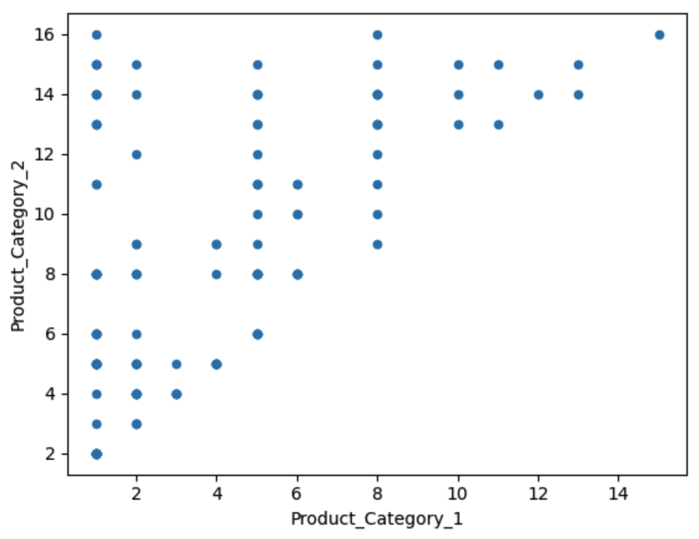
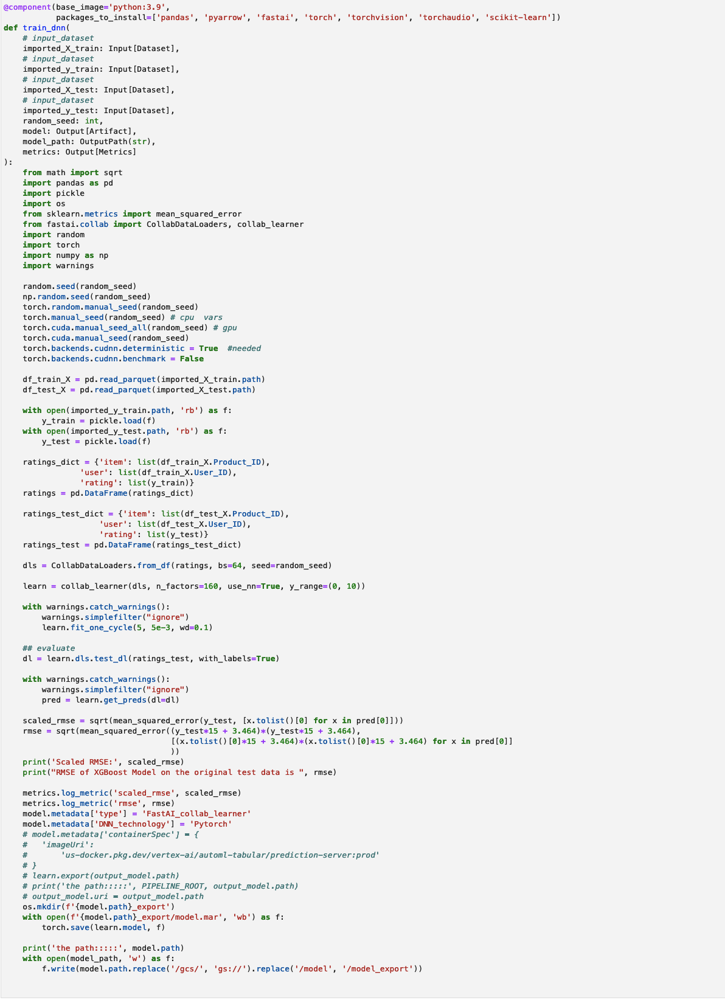

# Black Friday Case Study

# Table of Content
- Problem Statement
- Goal Analysis
- Data Analysis
- Feature Engineering
- Data Preprocessing
- Model Selection
   - Regressional Solutions
   - Recommendation Solutions
- Model Training
- Model Evaluation
- Fairness Analaysis
- Model Deployment
- Conclusion
- Resources

## Problem Statement
The requirements for the Black Friday case study was:

    Example of an end-to-end machine learning pipeline using the Black Friday dataset to increase profits. This demo can be implemented using either Vertex AI (or Endpoints) or Dataproc, and can utilize any available machine learning library on Google Cloud (for example, XGBoost, scikit-learn, tf.Keras, Spark machine learning).

The Black Friday Kaggle dataset, which is six years old, has been downloaded over 32,000 times and analyzed publicly in over 100 notebooks and articles. Although the Kaggle Black Friday Prediction dataset is popular, its purpose is unclear and there is no data dictionary to explain the data in detail. Before we can do any further analysis, we need to understand the dataset's goal, how it was prepared, and why it was designed in a particular way. This information is essential for feature engineering, model selection, and evaluation downstream. In real-world machine learning projects, this preliminary analysis is also important because the best machine learning solutions can only be built on a deep understanding of the data.

## Goal Analysis
    Note: The following analysis can be found in the 01-EDA.ipynb.

The first step is to understand what kinds of analysis the dataset allows us to achieve. By comparing the training and test sets, it is clear that all users and products in the test set are also in the training set, the the combination of user and product in the test set has no intersection with the same combination of the train set. 

The goal is to use users' past purchases to predict how likely they are to buy other products. To achieve this, we need to build a recommendation system instead of a regular regression model. The interaction between the user and the product is the most important feature for learning personalized patterns. This is the key difference between our solution and most other Black Friday prediction analyses, which treat the task as a regression problem.

The main problem with regression solutions for Black Friday prediction is that they need to treat all users and all products as categories in order to learn user-product interaction patterns well. However, this can lead to the high-dimensionality curse, since users and products are high-cardinality features. As a result, all regression-based Black Friday prediction analyses either have to drop the Product_ID feature or bin it, which prevents them from learning personalized purchasing behaviors.

This case study will show how to use recommender solutions to solve the problem of Black Friday prediction, and how to use regression technology correctly.

## Data Analysis
    Note: The following analysis can be found in the 01-EDA.ipynb.
    
The univariate analysis and bivariate analysis was done by using the framework ydata-profiling that can automatically generate profiling reports. The basic information of the dataset are:

1. There are 550 thousands rows and 12 columns. Some of the features are presented as numerical data type. There are 5891 unique users and 3631 unique products. 

2. Most data categories are imbalanced.

3. Product_Category_1 is always greater than Product_Category_2, and Product_Category_2 is always greater than Product_Category_3

4. Users are not evenly distributed in the cities. Some male users of certain occupations are more popular in certain cities.

5. The purchase data, or the target, is slightly right skewed with Skewness 0.6001400037087123
and Kurtosis -0.33837756558517285

6. There's no significant purchasing behavior differences related to the user features

## Feature Engineering
    Note: The following analysis can be found in the 01-EDA.ipynb.
Based on the explorative data analysis, we found that:
1. Despite that the product_category_1, product_category_2, product_category_3, user_id, occupation and marital_status are all numerical, they are more likely to be categorical features instead. In the following feature processing, we will cast all data features as categorical. 
2. The product_category_2 and product_category_3 have quite a few missing values. Especially the product_category_3 has a very high missing value rate. Considering the triangual patterns between product_category_1 vs. product_category_2, and product_category_2 vs. product_category_3 we believe the missing values are on purpose. We will keep all the missing values and will deal with them in the data processing.
3. We decide not to introduce feature interactions because the combination of 3 and 4 features can't find strong patterns. 
4. The target column is slightly right skewed. We will use square root transformation to bring it into normal distribution.
5. Because of the implementation of some of the recommendation lib, the target can only be within [0.0, 10.0]. Accordingly, we will transfer the target into that range by using the formula:

    transfered_target = sqrt(target - 3.464) / 15
6. We are going to experiement two different types of models: recommender and regression. These models require different data features. Therefore, we need to prepare data in two different ways:
    
    - recommender systems we are going to build only use user, product and the target. They are going to deal with categorical features directly. Thus no other data processing needs to be done.
    - regression systems requires categorical features to be transformed into numerical format. To avoid high dimension issue and still preserve information as much as possible, we use target encoding to transform all the 11 data features. Unlike label encoder or one-hot encoder that encode the categories into integer ids, target encoding use statistical information to represent the categories. In our case, we use the category grouped mean value of the target as the representative value. And we treat the missing value of the categories as a meaniful level. 
    
## Data Preprocessing
    Note: The following analysis can be found in the 05-KFP_Pipeline.ipynb.

The original data file, train.csv, was uploaded on the GCS bucket. 

    DATA_URI = "gs://blackfriday_data/train.csv"
    
The first step of the data processing is to import the csv data file into KFP Dataset.

Then, the KFP Dataset will be imported into a Pandas Dataframe. At the mean while, all data features will be casted into string data type for the downstream process to take them as categorical features.

The Purchase values will be square root tranformed, and shrinked into the range of [0.0, 10.0] in the transformation component:

The transformed dataset will be split into X_train, y_train, X_test, y_test in the traintestsplit component:

The last step of data preprocessing is to get X_train and X_test target encoded in the target_encoding component. 

## Model Selection
###  Regressional Solutions
    Note: The following analysis can be found in the 02-Regression_Models.ipynb.
    
Based on the same preprocessed data features, we compared the performance of three regular regression models: Linear Regressor, XGBRegressor, and LightGB Regressor. We use RMSE of the scaled the target value as the main metrics and calculated the RMSE on the original target values to make it easier to understand. 

The code and performance are as follows:

- Linear Regressor

- XGBoost Regressor

- LightGB Regressor

As it turned out, XGB Regressor is the best performant in the three models. It's scaled RMSE was 0.8846 while the original target RMSE was 2522.13 which outperformed most of the open analysises. 

The feature importance chart of the XGB Regressor model is:

From the chart we can spot that user_id and product_id was the top two strongest features. That justified the inclusion of user_id and product_id by target_encoding. 

###  Recommendation Solutions
    Note: The following analysis can be found in the 03-Recommendation-FastAI.ipynb and 03-Recommendation-Surprise.ipynb.

There are different implementations of recommendation system. In this case study, we compared two technolgies:

- SVD

SVD stands for Singular Values Decomposition. Essentially, it treats the interaction of user, product, and purchase has a huge two dimensional matrix, with user as one dimension and product as another dimension. The cell values represents the purchases that the user has made on that product. The algorithm will use either the user-to-user similarity or product-to-product similarity to predict user's purchase on new product. The huge user-product matrix is a very sparse, high-cardinal data structure that is hard to compute. SVD decompose it into three low rank matrix to enable the computation: 

We implemented the SVD with the Surprise recommendation framework and we compared the performance of several other implementations, for example: KNN, NMF, Colaborative Filter, etc. We found the SVD performans better than other technologies. 

We can see that the SVD model produced scaled RMSE of 0.8876, which is very close to the XGB Regressor.

- Deep Learning

In the obove SVD technology, the high-cardinal user and product features were decomposed into low-ranking matrix. This operation can also be interpreted as encoding the user and product features into low-ranking embeddings. Thus the embeddings can represent inherent similarities inside users and products. And then we can use generic Deep Learning technology to learn the interaction between the user and product. In our implementaion, we use FastAI collab_learner that is a Pytorch based basic recommendation model. The model structure is the following:

When running on the notebook, the Deep Learning model achieved scaled RMSE of 0.8624, which is significantly better than the XGB Regressor.

## Model Training
    Note: The following analysis can be found in the 05-KFP_Pipeline.ipynb.

The deployed XGB model training is in the train_xgb component:

The deployed DNN Pytorch model training is in the train_dnn component:

## Model Evaluation
    Note: The following analysis can be found in the 02-Regression_Models.ipynb and 03-Recommendation-FastAI.ipynb.
    
So far, the best DNN model achieved scaled RMSE of 0.8624, while the best regresion model, XGB Regressor achieved 0.8846. The difference seems not significant. Lets see how the results look like.

As it turned out, the models are over estimate for low target values and under estimate for high target values. And the DNN model result is slightly closer to the diagnal line. That meas the DNN model made less mistakes for both low target values and high target values. 

A residual analysis has been done to spot whether there's any imbalanced errors. As it turned out, imbalanced errors do exist but not very significant. The imbalanced performance is closely related to the imbalanced data distribution. One proach to fix the problem is augment the unpopular categories. We elected not the augment the data because the performance differences are not too bad.  

## Fairness Analaysis
    Note: The following analysis can be found in the 02-Regression_Models.ipynb.

The fairness analysis was based on the XGB Regressor model because the SVD and DNN models don't consider any demographic features and product category features. In order to evaluate the impact of including and excluding demographic features, we built a 'fair model' that is trained without demographic data features. The fair model achieve scaled RMSE of 0.9005, which is lower than the same xgb model with demographic features. 

The importancy plot shows that user_id and product_id are still the strongest features. 

When we compare the ground truth values, best xgb model predictions, and fair model predictions, we found that in vast majority cases the fair model slightly under perform than the xgb model. There are also scenarios that inclusion of demographic features made performance worse. One of the examples is that including demogrphic features making better prediction for female but makeing worse prediction for male. 

We compared the residual of the XGB Regressor model vs. the fair model, and found there's no systemetical bias by adding or removing the demographic features. 

We analysed the RMSE distribution in all the categorical levels, and found that inclusion of the demographic features making the performance evenly improved. 

Based on the above analysis, we concluded that the inclusion of the demographic features didn't cause unfair prediction. 

## Model Deployment
    Note: The following analysis can be found in the 05-KFP_Pipeline.ipynb.

As depicted above, the Vertex pipeline was composed of the whole process of the following steps:
1. import train.csv from gcs bucket
2. load data into Pandas dataframe
3. transform the dataset by casting all data features into category and scale the target into [0.0, 10.0]
4. split the traing and test datasets
5. target encoding all categorical features
6. train Pytorch DNN model and XGBoost model
7. register the trained Pytorch DNN and XGBoost models
8. create two endpoints
9. deploy both the two models to their individual endpoint

The pipeline has beed designed to be modifiable by changing parameters like random_seed, train-test split ratio etc. Both the scaled RMSE and the original RMSE were published as the result of the model training. 

## Conclusion

Compared to most openly available Black Friday analysis, this case study produced higher performance. The lessons we learnt from the case study were:
1. Using target encoding to deal with high dimensional categorical data features is a good idea.
2. The user_id and product_id that are generally considered as low importancy features, however, by the help of recommendation concept, we can discover important patterns from the interactions of the user and product. The information was so rich that it outweight the information in all other data features. 

Limited by time and budget, the case study didn't dive deeper to achieve the highest performance. Things to consider in the further performance enhancement are:
1. The Deep Learning outperforms all other models. It only use the user_id and product_id. It worths to include embedding of other features
2. The DNN model only has one fully connected layer. Probably the performance can increase with a more sophisticated model

## Resources
- Code repository:
    https://github.com/kaloollylilly/BlackFriday_casestudy.git
    
- GCP project: blackfridayintelia
- Vertex pipeline: https://console.cloud.google.com/vertex-ai/locations/us-central1/pipelines/runs/blackfriday-pipeline-v0-20231101052843?project=blackfridayintelia&supportedpurview=project
- Deployed models:
    - DNN model: https://console.cloud.google.com/vertex-ai/locations/us-central1/models/2955405891601432576/versions/1?project=blackfridayintelia&supportedpurview=project
    - XGB model: https://console.cloud.google.com/vertex-ai/locations/us-central1/models/7472516317854040064/versions/1?project=blackfridayintelia&supportedpurview=project
- Deployed endpoints: 
    - DNN endpoint: https://console.cloud.google.com/vertex-ai/locations/us-central1/endpoints/2140390698489217024?project=blackfridayintelia&supportedpurview=project
    - XGB endpoint: https://console.cloud.google.com/vertex-ai/locations/us-central1/endpoints/334447247913648128?project=blackfridayintelia&supportedpurview=project